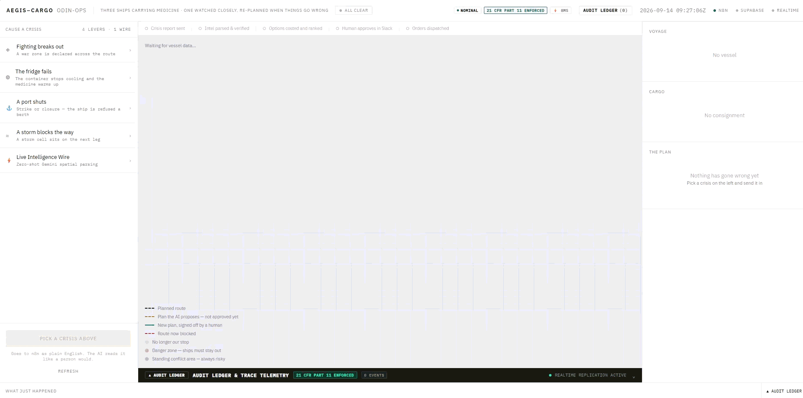
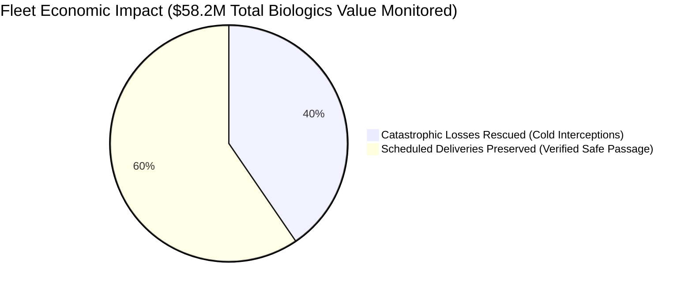
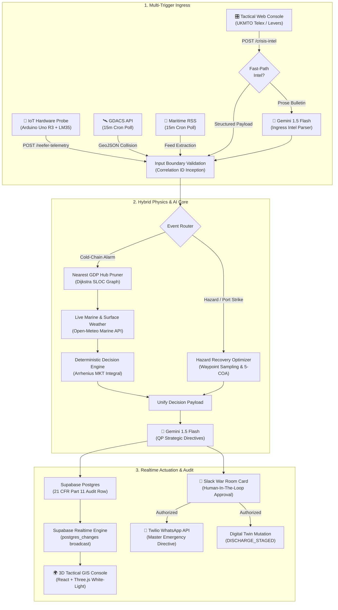
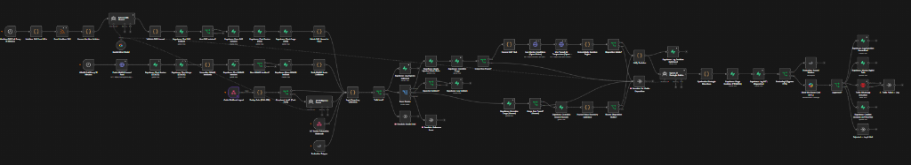

# AEGIS-CARGO (ODIN-OPS)

> **Autonomous Geopolitical & Cold-Chain Freight Interceptor Built on n8n, Gemini 1.5 & Supabase Realtime**  
> 🏆 **1st Place — Best Creativity & Innovation (Solo Entrant)** — *n8n University Hackathon Sydney 2026 (USYD / SUAIA / StartUp Link)*  
> Built and demonstrated solo by **Aranya Maji** (Mechatronics & Computer Science, UNSW). Entry registered 24 hours prior to kickoff.

---


-blueviolet?style=for-the-badge)


---



---

## 1. Executive Summary & Problem

Global logistics carries over **\$58 Million** in temperature-critical biological therapeutics (monoclonal antibodies, cell therapies, and mRNA vaccines) through high-risk geopolitical chokepoints (Bab-el-Mandeb, Strait of Malacca, Suez Canal, North Atlantic air corridors).

Under **EU Good Distribution Practice (2013/C 343/01)** and **FDA 21 CFR Part 211**, thermal excursions are binary: if cumulative thermal degradation breaches the stability ceiling (+8.0°C), **the entire consignment must legally be destroyed**. Cargo owners cannot discount, reprocess, or re-route expired biologics.



### The 3-Tier Financial Model
1. **Tier 1: \$23.56 Million Net Catastrophic Loss Rescued**  
   10 active reefer failures intercepted before Mean Kinetic Temperature (MKT) breached +8.0°C, routing to GDP cold-storage staging hubs (Salalah, Singapore, Rotterdam).
2. **Tier 2: \$34.64 Million Scheduled Deliveries Preserved**  
   15 geopolitical drone/missile alerts, port strikes, and cyclones evaluated across forward waypoint vectors. The engine verified clear passage at 10 NM intervals, choosing `CONTINUE` with **0 hours of ETA slip**.
3. **Tier 3: ~\$380,000+ Panic Diversion Costs Eliminated**  
   Prevented unnecessary bunker fuel waste and emergency air charter scrambles triggered by false alarms.

---

## 2. End-to-End System Architecture

AEGIS-CARGO pairs a **deterministic physics and routing engine** (<20 ms) with a **multimodal dual-AI architecture** (Gemini 1.5 Flash), orchestrated across a 66-node n8n DAG. The system operates on dual operational mandates: **predictive threat tracking** (proactively monitoring emerging risks and escalating surveillance before failure) and **instantaneous emergency reaction** (executing sub-second reroutes the moment chokepoints or thermal limits are breached).

### Multi-Source Intelligence & Telemetry Ingestion
- **Live Military Conflict Data:** UKMTO telexes, MARAD advisories, and IMB piracy alerts across global strategic corridors (Bab-el-Mandeb, Strait of Malacca, Hormuz).
- **Real-Time Disaster Feeds:** GDACS (tropical cyclones, tsunamis, volcanic hazards) and USGS (seismic events) for geospatial collision detection against forward vessel waypoints.
- **Breaking Maritime Intelligence Wires:** Lloyd's List, Reuters, and maritime trade feeds, using Gemini 1.5 Flash to convert raw unstructured prose into structured incident coordinates.
- **Edge IoT Cold-Chain Telemetry:** Physical Arduino Uno R3 + LM35 temperature sensor streaming core thermal kinetics, instantly tripping emergency webhooks upon threshold breach.



### Live 66-Node Production Orchestration Canvas


---

## 3. Core Subsystems

### A. Deterministic Physics & MKT Engine (<20 ms)
- **Arrhenius Mean Kinetic Temperature (MKT):** Evaluates biological thermal decay using non-linear activation energy integrals:
  $$\Delta H / R = 10{,}000\,\text{K}$$
- **Admiralty Fuel & ETA Penalties:** Models fuel burn scaling as $F \propto v^3$ against deadweight displacement ($\Delta^{2/3}$) to calculate true diversion penalties.
- **28-Waypoint Maritime SLOC Dijkstra Graph:** Pre-computed deep-water sea lanes verifying draft restrictions ($>12\,\text{m}$ depth) and GDP quay-side reefer plug capacities.

### B. Dual-AI Architecture (Gemini 1.5 Flash)
- **Ingress Parser:** Converts raw, unstructured military conflict telexes (UKMTO, MARAD), real-time disaster alerts (GDACS, USGS), and breaking maritime wire feeds (Lloyd's List, Reuters) into structured geospatial collision perimeters and threat classifications.
- **Egress Strategic Directive Synthesizer:** Acts as an autonomous pharmaceutical Qualified Person (QP) under EU GDP guidelines, synthesizing legally defensible clinical risk assessments for Slack War Room cards and Twilio WhatsApp emergency dispatches.

### C. Tactical 3D Command Console (`globe/`)
- Built with **Vite + React + Three.js / react-globe.gl**.
- High-contrast white-light tactical command aesthetic.
- **Fleet of Three:** 
  - *CMA CGM Tigris* (Red Sea / Suez Corridor, Container `MED-7702`, \$2.40M Monoclonal Antibodies)
  - *Ever Given* (South China Sea / Malacca Corridor, Container `BIO-4419`, \$1.80M mRNA Vaccines)
  - *Maersk Mc-Kinney* (Transatlantic Air Freight B777F, Container `CELL-9011`, \$3.10M Cell Therapies)
- **21 CFR Part 11 Regulatory Audit Drawer:** Live terminal log stream subscribed via Supabase Realtime to `system_execution_logs`.

### D. Physical Hardware IoT Telemetry Probe (`hardware/`)

<p align="center">
  
</p>

- **Hardware Rig:** Physical Arduino Uno R3 connected to a Keyestudio DS18B20 temperature sensor probe (`hardware/arduino_reefer_telemetry/arduino_reefer_telemetry.ino`).
- **Edge Telemetry Daemon:** Python serial bridge daemon (`hardware/arduino_reefer_telemetry/serial_bridge.py`) polling sensor telemetry at 9600 baud.
- **Direct Webhook Tripping:** Upon crossing thermal threshold (28.0°C), directly initiates emergency cold-chain triage via `POST /reefer-telemetry` into n8n with zero cloud delay.

---

## 4. Benchmark Results (`AEGIS_BENCHMARK_25`)

The system was evaluated against 25 adversarial scenarios (46 total executions) via n8n's native Evaluation Framework:

| Metric | Result | Benchmark Significance |
| :--- | :--- | :--- |
| **Total Test Scenarios** | **25 Scenarios** (46 Executions) | Red Sea, Malacca, Taiwan Strait, North Atlantic |
| **Pipeline Success Rate** | **100.0%** (0 unhandled crashes) | Deterministic fallback prevents deadlocks |
| **Core Physics & MKT Latency** | **16 – 20 ms** | Real-time Dijkstra pathfinding + Arrhenius integration |
| **Live Environmental Enrichment** | **250 – 400 ms** | Open-Meteo Marine (waves, sea-surface temp, 2m air temp) |
| **Egress AI Strategic Directives** | **6.5 – 9.2 s** | Gemini 1.5 Flash QP regulatory briefing |
| **HITL Blast Radius Isolation** | **100% Zero Blast Radius** | Zero accidental WhatsApp pings during benchmark mode |

*Full scenario breakdown available in [`BENCHMARK_RESULTS.md`](BENCHMARK_RESULTS.md).*

---

## 5. Quickstart Guide (Reproducing Locally)

### 1. Initialize Supabase Database
1. Create a project at [supabase.com](https://supabase.com) (or use local Docker).
2. Open the **SQL Editor** in your Supabase dashboard.
3. Paste and run the contents of [`supabase/seed.sql`](supabase/seed.sql).
   - This creates all 5 tables (`vessels`, `cargo_consignments`, `tactical_incidents`, `action_audits`, `system_execution_logs`), enables RLS, sets up Realtime publication, and seeds the fleet via `reset_demo_state()`.

### 2. Import n8n Workflow
1. Open your n8n workspace (Cloud or Self-Hosted).
2. Go to **Workflows → Import from File** and select [`workflow_skeleton.json`](workflow_skeleton.json).
3. Configure your credentials for:
   - **Google Gemini API** (Gemini Chat Model)
   - **Supabase API** (Service Role or Anon Key)
   - **Slack API** (War Room approval card)
   - **Twilio API** (WhatsApp dispatch, optional)
4. Set the workflow to **Active**.

### 3. Run Tactical 3D Globe Console
```bash
cd globe
npm install
cp .env.example .env.local
```
Fill in your `.env.local`:
```env
VITE_SUPABASE_URL=https://your-project.supabase.co
VITE_SUPABASE_ANON_KEY=your-anon-key
VITE_N8N_WEBHOOK=https://your-n8n-instance/webhook/crisis-intel
```
Launch the development server:
```bash
npm run dev
```
Open `http://localhost:5173` to access the white-light tactical command interface.

### 4. Run Hardware Telemetry Probe
```bash
cd hardware/arduino_reefer_telemetry
pip install pyserial requests

# Failsafe test (triggers reefer telemetry without hardware):
export AEGIS_WEBHOOK="https://your-n8n-instance/webhook/reefer-telemetry"
python serial_bridge.py --fire

# Live Arduino probe:
python serial_bridge.py --port COM3
```

---

## 6. License & Intellectual Property

Developed by **Aranya Maji** for the **n8n University Hackathon Sydney 2026**.  
Copyright © 2026 Aranya Maji. All rights reserved.

This repository, its algorithmic models, mathematical formulations, and workflow architectures are made available for **portfolio evaluation, demonstrative assessment, and academic inspection only**. Commercial use, reproduction, distribution, reverse engineering, or deployment into third-party software without prior written authorization is strictly prohibited. See [`LICENSE`](LICENSE) for complete terms.

